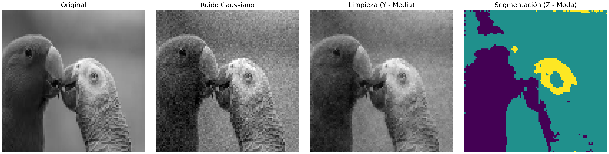

# Ejemplo de campos de Gibbs para la limpieza y segmentación de imágenes

En este repositorio se presenta una aplicación de los campos de Gibbs a la limpieza y segmentación de imágenes. La idea es aprovechar que, en
muchas imágenes, los valores de los pixeles tienden a variar de forma suave, en el sentido de que un pixel se parece a sus vecinos y los cambios
bruscos suelen concentrarse en bordes o contornos. Bajo este supuesto, se construye un modelo tipo campo de Gibbs que asigna mayor probabilidad
a imágenes ordenadas y menor probabilidad a configuraciones con cambios abruptos y aislados que son característicos del ruido. Sin embargo, como
el número de posibles configuraciones de una imagen es enorme, no es posible evaluar el modelo de forma exacta ni explorar todas las alternativas.
Por ello se recurre a simulación Monte Carlo mediante cadenas de Markov (MCMC). El algoritmo actualiza la imagen pixel por pixel, tomando
decisiones que dependen del vecino inmediato y de la información observada. Después de un número suficiente de iteraciones, el método genera una
colección de imágenes restauradas plausibles. A partir de esas realizaciones se construye una reconstrucción final.

```text
Algoritmo: Muestreo de Gibbs conjunto

Entrada:
  Imagen X
  Clases K
  Varianza σ²
  Pesos β_Y, β_Z
  Burn-in B
  Muestras S_m

Inicializar Y ← X
Inicializar Z ← Quantize(X, K)
M_Y ← ∅, M_Z ← ∅

for t = 1 to B + S_m:
    for cada píxel i en S:
        Obtener vecinos y_Ni, z_Ni (8-conectividad)

        para cada f_k en L_Y:
            E_Y(f_k) ← (f_k - x_i)² / (2σ²) + β_Y Σ|f_k - y_j|
        muestrear Y_i ~ P(f_k) ∝ exp(-E_Y)

        para c en {1..K}:
            E_Z(c) ← (μ_c - x_i)² / (2σ²) + β_Z Σ(1 - δ(c, z_j))
        muestrear Z_i ~ P(c) ∝ exp(-E_Z)

    if t > B:
        guardar Y → M_Y
        guardar Z → M_Z

Ŷ ← MediaMatricial(M_Y)
Ẑ ← ModaMatricial(M_Z)
```

Estos son los resultados que se obtuvieron.


